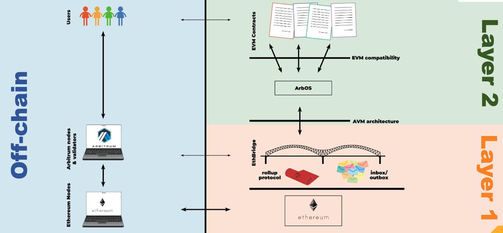

# Arbitrium简介[WIP]

[TOC]

## 为什么使用Arbitrum？
Arbitrum是一种用于以太坊的L2扩容解决方案，能够带来以下特别的独特的收益：
  - 无信任安全性：安全性植根于以太坊，任何一方都能确保第L2的结果是正确的
  - 与以太坊兼容：能够运行不需要经过任何修改的EVM智能合约以及以太坊事务
  - 可伸缩性：将合约的计算和存储从以太坊主链中移出，允许更高的吞吐量
  - 最小化成本：每笔交易成本消耗的L1 Gas最小化
  - 实现其他一些L2系统提供的功能的组合

## Arbitrium架构
Arbitrium的架构图如下：

左侧，我们有用户和服务提供商，他们帮助用户连接到自己选择的链。右边是Arbitrum系统本身，它在以太坊的上层构建。
实现，我们描述右边的Arbitrum栈是如何工作的，然后再讨论左边的用户连接如果连接。
右下角也就是传统的以太坊，Arbitrum构建在以太坊之上，并从以太坊继承其安全性。
在以太坊的上方是即是EthBridge。EthBridge一组以太坊智能合约，用于管理Arbitrum链。EthBridge使用Arbitrum rollup协议，该协议确保它上面的层正确运行。EthBridge还维护链的InBox与OutBox，允许用户以及智能合约向链发送事务消息，并会监视并使用这些事务的输出。用户、L1以太坊合约以及Arbitrium调用EthBridge合约用于与Arbitrium链进行交互。
EthBridge上方的部分可以认识是AVM架构，因为EthBridge提供给它上面的层的是一个Arbitrum虚拟机（也就是AVM），它可以执行一个读取输入并产生输出的计算机程序。这是Arbitrum中最重要的接口，因为它将L1和L2分开--提供“收件/执行/发件”抽象将L1与L2分开。
再接下来往上一层也就是ArbOS，这是个运行AVM虚拟机的程序，这个程序作为一个信息保管器、流量控制器以及Arbitrium链上的合约执行器存在。它叫ArbOS是因为它其中扮演的角色类似一个轻量级的操作系统，该程序首先启动并管理链shang所有其他代码执行的程序。最重要的是，ArbOS完全运行在L2上，以脱离L1，因此可以充分利用L2的可伸缩性与低计算成本。
ArbOS上方被称为EVM兼容层，因为ArbOS为智能合约提供了与EVM兼容的执行环境，也就是说，用户可以向ArbOS发送相同的EVM代码，就像将智能合约发送到以太坊上一样，ArbOS将加载智能合约用于处理事务，就跟在以太坊上做的一样。ArbOS处理了兼容性的细节，因此智能合约的开发者可以像在以太坊上那样编写代码（或者一般只需要使用现有的以太坊智能合约重新部署它们）。
在图的最右上角是EVM合约，开发者可以将其部署到Arbitrium链，并执行提交到该链的事务。
这是整个架构图右侧的描述，它提供了Arbitrum链的功能，现在我们赚到架构图的左侧，他们是直接与用户相关的部分。
左下角是标准的以太坊节点，用于与以太坊链进行交互。其上方的是Arbitium节点，顾名思义，就是用来与Arbitrium链进行交互的节点。它们支持与以太坊相同的API接口，所以他们能与现存的以太坊工具很好地一起工作，例如我们能在Arbitrum节点使用以太坊兼容的钱包或者工具，反之亦然。就像以太坊一样，任何人都可以运行Arbitrium节点，但是有些用户会选择依赖一个别人的节点作为替代。
一些Arbitrium节点用于处理用户请求，其他的用于扮演一个验证者的角色，这些验证者用于确保Arbitrum链的正确性。
最后，左上侧就是用户了。用户使用钱包、DAPP前端以及其他与Arbitrium交互的工具。因为Arbitrium节点支持以太坊相同的API，因此用户并不需要一个全新的工具，开发者也不需要重写他们的DAPP。

## 位于“分界线”上方还是下方？
我们提到，在Arbitrium结构中，分开L1与L2重要分界线就是AVM接口。这个分界线可以帮助我们思考特定的行为到底是位于的分界线的上方还是下方。
在分界线下方主要是用于提供确认AVM正确性的功能，分界线的上昂则是假设AVM会正确执行且专注于与运行L2上的软件的交互。
例如，Validator即在下方运行，因为它们参与rollup 协议，而rollup协议由EthBridge在分界线下管理的，以确保确认AVM的正确执行。
再例如，Arbitrum节点所有的操作都在分界线上方运行，因为它们在本地运行AVM的一个副本，并假设分界线下机制将确保它们在本地计算的相同结果，并最终将由它们不监视的线下机制确认。
大多数用户，大多数时候，都会用分界线以上的视角，他们将Arbitrium链当作另一个链进行交互，而不必操心分界线下不出错的实施细节。

## EthBridge
EthBridge是一组管理Arbitrium链的以太坊智能合约。EthBridge记录链的InBox内容、链状态的HASH以及有关输出的信息。EthBridge是关于Arbitrum链中发生的事情的最终权威来源。
EthBridge是建立Arbitrium安全性基石。EthBridge运行在以太坊上，因此它是透明的，并且可以去信任（trustless）地执行。
InBox合约管理链的inbox。Inbox用于记录Inbox中每个消息的HASH。调用Inbox的send类方法的其中之一将在Arbitrum链的Inbox中插入一条消息。
InBox合约确保传入消息中的某些信息是准确的：发送者被正确地记录，以太坊块号和时间戳被正确地记录在消息中。
相应的，还有一个OutBox合约，用于管理链的输出：例如，一条来自Arbitrum的消息，应该（最终）在以太坊上发生的消息（特别是转账）。当Rollup块被确认，该Rollup块中生成的输出将放入outbox。
Rollup合约及相关的合约负责管理Rollup协议。它们跟踪Arbitrium链的状态：提议、接受和/或拒绝的Rollup块，以及谁在哪个Rollup节点上有stake。
Challenge合约及相关合约负责跟踪和解决Validator之间关于哪个Rollup块是正确的争议。
